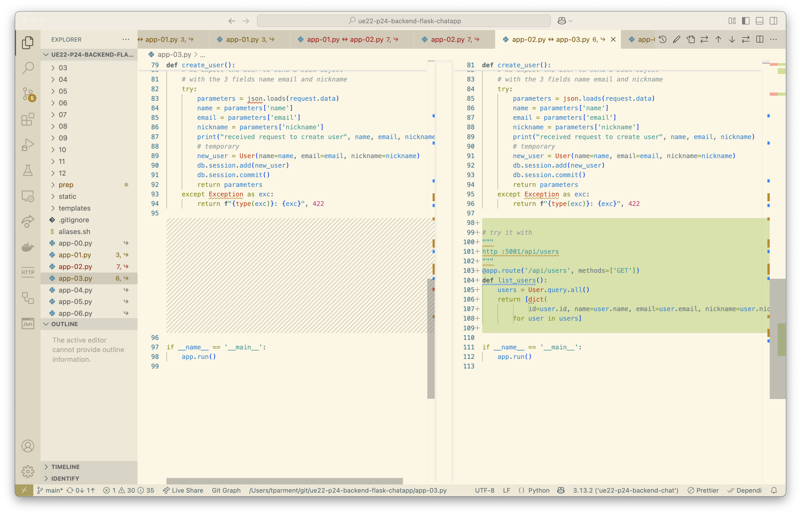

# a chat application in Flask

This is a simple chat application in Flask. It is developed in a series of
steps.

Each step is materialized in a folder numbered `00` and onwards.

**DISCLAIMER**: this is a toy application! Almost every aspect of a real app is kept **oversimplified** here.
The goal is purely educational, and to show all the pieces (database, API, ws, frontend) working together.

Likewise, ideally we wanted to show the advantages of websockets; SocketIO is a
higher-level library that leverages websockets, which yields much simpler code
than using websockets directly. However it might not be the best choice in real
applications due to e.g. language constraints, so there's that.

## Steps

| Step | Description |
| --- | --- |
| 00 | the simplest possible hello world app
| 01 | add a /db/alive endpoint to check if the database is alive
| 02 | add a /api/users POST endpoint to create a user
| 03 | add a /api/users GET endpoint to list users
| 04 | /front/users serves a web page to see the users
| 05 | redirect the / route to /front/users
| 06 | new GET endpoint /api/users/<user_id> to retrieve a single user
| 07 | new POST endpoint /api/messages to create a message
| 08 | new GET /api/messages/ to retrieve all messages
| 09 | new GET /api/messages/with/<user_id> endpoint - first draft
| 10 | /api/messages/with/<user_id> returns both from and to user
| 11 | /api/messages/with/<user_id> returns users details
| 12 | /front/messages/<user_id> builds a html page to see messages
| 13 | the HTML page adds an <input> tag to send messages
| 14 | the HTML page locally displays the message it just sent
| 15 | /api/messages creation endpoint returns more details
| -- | at this point we start injecting SocketIO in the mix
| 16 | app.py enables SocketIO & the front (HTML) messages page connects to the socket
| 17 | pass current nickname to the JS code
| 18 | backend notifies of new messages on the socketio channel
| 19 | properly display incoming messages in the frontend

## requirements

Like always you need to install the requirements:

```bash
pip install -r requirements.txt
```

## important: one DB per step

The application uses a SQLite database. The database is created in the
`instance` folder in a file named `chat.db`. The database is created by the
application if it does not exist.

This means that each step has its own database. So when moving from one step to
the next, you need to populate it again


## how to run - the regular way

### run the app in a terminal

to run step, say, number `07` you would do:

```bash
cd 07

# if you need to scratch the database
rm -f instance/chat.db

# let's use port 5001 for safety as port 5000 is bound by airtunes on MacOS
flask run --debug --port 5001
```

### interact with the app in another terminal

then **in another terminal**, you can do things like (availability depends on the actual step)

```bash
# is the db alive?
http :5001/db/alive

# what step are we running
http :5001/api/version

# create users
http :5001/api/users name="Alice Caroll" email="alice@foo.com" nickname="alice"
http :5001/api/users name="Bob Morane" email="bob@foo.com" nickname="bob"
http :5001/api/users name="Charlie Chaplin" email="charlie@foo.com" nickname="charlie"

# list users
http :5001/api/users

# get details of user 1
http :5001/api/users/1

# create dialog between 1 and 2
http :5001/api/messages author_id=1 recipient_id=2 content="trois petits chats"
http :5001/api/messages author_id=2 recipient_id=1 content="chapeau de paille"
http :5001/api/messages author_id=1 recipient_id=2 content="paillasson"
http :5001/api/messages author_id=2 recipient_id=1 content="somnambule"
http :5001/api/messages author_id=1 recipient_id=2 content="bulletin"
http :5001/api/messages author_id=2 recipient_id=1 content="tintamarre"
# create message between 2 and 3 - not seen by 1
http :5001/api/messages author_id=2 recipient_id=3 content="not visible by 1"

# list all messages (not very useful)
http :5001/api/messages

# list messages visible to user 1
http :5001/api/messages/with/1
```

### interact with the app from  a browser

or to open in your browser

```bash
# the entry point
http://localhost:5001/

# the list of users; will offer links to the next page
http://localhost:5001/front/users

# the list of messages for user 1
http://localhost:5001/front/messages/1
```

## an easier way - works on MacOS and linux

to avoid having to change folders and restart flask all the time, you can use the `version.sh` script

```bash
# once and for good
cd flask-chatapp
flask run --debug --port 5001
```

then in another terminal

```bash
# switch to step 04
./version.sh adopt 04

http :5001/api/version

-> will show 04

# will start fresh the first time you use that step
http :5001/api/users

-> empty at first

# and then use the commands as above
```

in short, there is no need to stop flask, change folders, etc...

## diffs

in addition, the `version.sh` script will create symlinks named `app-00.py`, `app-01.py`, etc... in the toplevel folder, so one can easily see the code differences between steps; for example:

- open `app-00.py` in vs-code
- open `app-01.py` in vs-code
- from `app-00.py`, open the palette and select `compare with file`
- select `app-01.py`

for example here's how the diff between step 02 and 03 looks like:



## see also

* [Flask](https://flask.palletsprojects.com/en/stable/quickstart/)
* [Flask: the request datatype](https://tedboy.github.io/flask/interface_api.incoming_request_data.html#flask.Request.data)
* [SQLAlchemy databases with metadata](https://docs.sqlalchemy.org/en/20/core/metadata.html)
* [Flask SocketIO](https://flask-socketio.readthedocs.io/en/latest/getting_started.html)
